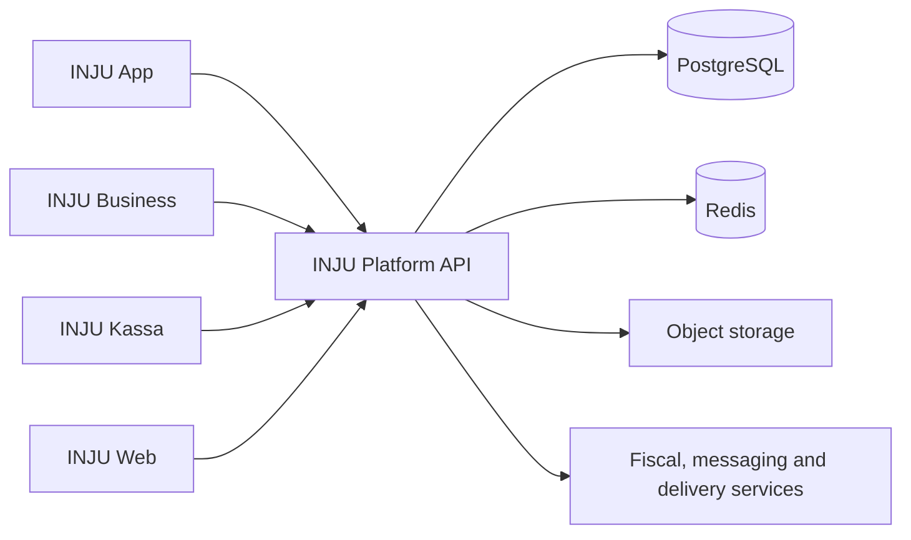

  

<h1 align="center">INJU</h1>

  <strong>A retail operating system for modern commerce.</strong> 
  Stores, suppliers, couriers and customers — connected in one ecosystem.

  
  
  

INJU brings everyday retail operations and digital commerce into a single, connected platform. It supports the complete flow from inventory and checkout to supplier orders, delivery and customer loyalty — with offline-first operation where it matters most.

> The product source code and production infrastructure are maintained privately. This repository is the official public home for product information, feedback and security guidance.

## One connected ecosystem

| Product | Built for | Core experience |
| --- | --- | --- |
| **INJU Business** | Owners, managers, cashiers, suppliers and couriers | Operations, inventory, orders, delivery and analytics |
| **INJU App** | Customers | Product discovery, reservations, delivery, reviews and loyalty |
| **INJU Kassa** | Retail checkout teams | Fast offline-first POS, receipts and fiscal or thermal printing |
| **INJU Web** | Businesses and platform administrators | Management dashboards, marketplace and operational control |

## What INJU covers

### Retail operations

- Offline-capable point of sale with safe synchronization
- Products, variants, barcodes, pricing and inventory
- Branches, staff, devices, transfers and consolidated reporting
- Shifts, sales, refunds, write-offs and electronic receipts
- Customers, debt tracking, payments, cashback and loyalty

### Commerce network

- Marketplace discovery, search, favorites, reservations and reviews
- Supplier catalogs, customer-specific pricing, orders and routes
- Courier workflows, staged delivery and payment tracking
- Partner-store exchange, surplus offers and business messaging
- Subscriptions, referrals and reward programs

### Intelligence and reliability

- Business analytics with AI-assisted insights
- Real-time updates across connected applications
- Idempotent checkout and resilient offline queues
- Fiscal integrations, printable receipts and auditable operations

## Platform architecture

INJU is built as a multi-platform product using **Go**, **Laravel**, **Vue**, **SwiftUI**, **Jetpack Compose**, **Flutter**, **PostgreSQL**, **Redis** and **Docker**.

## Availability

Visit **[inju.uz](https://inju.uz)** for current product information and access.

- Found an issue or have a product idea? Open a [GitHub issue](https://github.com/xurshidbek1806/inju.uz/issues).
- Found a security concern? Please follow our [security policy](SECURITY.md) and avoid publishing sensitive details.
- Source-code contributions are not accepted through this repository; see [contributing guidelines](CONTRIBUTING.md).

---

  Lead engineering by <a href="https://github.com/xurshidbek1806">Xurshidbek</a>

